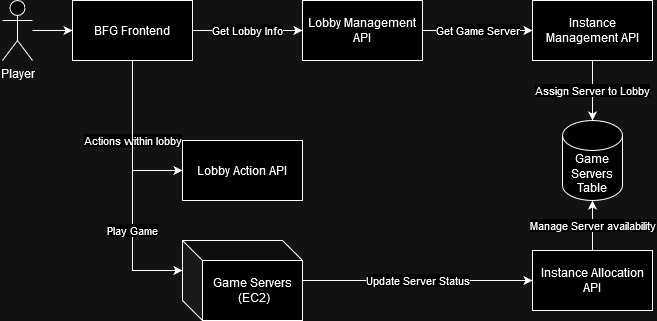
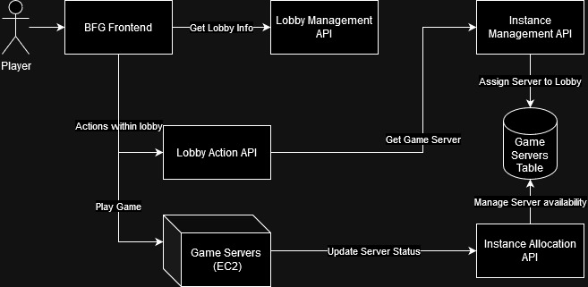

## 5/21/2022
- How do I respond to collisions? When a collision occurs, I want to notify
each affected party so that they have the info necessary to answer the
following questions:
  - What algorithm should I use to determine my response?
    - What type of entity in my dominion was involved in the collision?
    - What type of entity NOT in my dominion was involved in the collision?
    - What is my mapping from entity pairs to algorithms?
  - What parameters should be given to that algorithm?
    - What are all of the pieces of information that I can use? This is in
    a structured environment but seems to rely on nonstructuredness, so
    if I want to do something unstructured then I should use a map from
    strings to strings, and then use string parsing in my collision handlers
- So what does this decision look like in practice?
  - In the main collision loop, I run my basic collision checker. Instead of
  what it currently returns to me, it returns a collision event which contains
  two collision entity objects. Each object has a string 'type' field, and
  a list of properties. What's an example?
    - A character has an event so that, when its hurtbox collides with a hitbox,
    it takes damage and goes into a knockback state. Now we can say what the
    information it needs is:
      - What collision entity of its own was involved? **hurtbox**
      - What foreign collision entity was involved? **hitbox**
        - These first two things mean that we go to the "take damage" route.
      - What is the knockback?
      - What is the damage?

## 5/19/2022
- So I've run into a small conundrum when it comes to deining walking
animation in a character file. It's with controls transitions. When you
are in the idle animation, pressing moveLeft should take you to the first
frame of walking left. When you are in the walking left animation,
pressing left should take you to whatever the next frame is of the
current animation, and otherwise we should cancel and default to idle.
So how do I define this sort of behavior?
  - Idea 1: Make it so that, if the control leads us to a DIFFERENT animation,
  then we go to the first frame of it, and if it leads us to the SAME animation,
  we go to the NEXT frame of it. In what situation would this backfire? One
  where pressing the control should restart the current animation. I don't
  think that is common at all, so I think we are okay.
    - This could also backfire in the case where we have a chain of distinct
    animations that require you to hold the same button. We would need to
    define some sort of special type of control input where we go to the
    next animation if we are still holding down the key while on the LAST
    frame of the current animation. This can be done as a non-default option
    that we can read from the file, right?
- Next problem: Default transitions don't make consistent sense. In the idle
animation, doing nothing should take you to the next idle frame no matter what.
In the left animation, doing nothing should take you to the first idle frame,
rather than the next frame of the current animation.
  - Solution: Same deal as before--if it takes you to your current animation,
  then you should progress, and if it takes you to a different animation,
  you should go to frame 1.
  - Really, there should be an object oriented approach where each transition
  lists the name of a "destination resolver", which is an object that
  determines the mapping. That way we can handle arbitrarily complicated
  destination behavior.

## 3/2/2022
- I'm trying to figure out why there's an extra Visualizer in the top left
corner of the client whenever it is not the first to connect to the
server.
  - To replicate:
  1. Launch fresh server
  2. Run client
  3. Close client
  4. Run second client. Observe that there's an inert visualizer in the
  top left corner.
  - SOLVED: It's just because the map was being initialized with one
  starting dummy visualizer mapped to 0.
- When a client disconnects, their visualizer in other clients' visualizers
is still there.
  - The fix: Send a special message on the socket to a client to indicate
  a character has ceased to exist.

## TODO:
- Functionality:
  - Hitboxes/Hurtboxes
    - How will they be implemented?
      - Every game loop, every two characters will be checked for collision
      in a 2-dimensional loop. 
      - All collisions are symmetrical, and are dependent on the predicted
      next position of a character, which is based on the effect of their
      current state (or the pre-effect of their next state?) 
      - Collision events?
        1. hurtbox 1 to hurtbox 2 -> they move up next to each other and no
          further
        2. hurtbox 1 to hitbox 2 -> char1 reacts to being hit
          - this means a hitbox should also have a specified knockback velocity
          and damage.
        3. hitbox 1 to hurtbox 2 -> char2 reacts to being hit
        4. hitbox 1 to hitbox 2 -> nothing for now. Maybe a 'clash' animation
    - Idea: It's like XML so it's in a JSON file and it consists of a list of
    circles/ellipses/boxes, and together they make up the hitbox.
  - Make sure mutliple clients receive updates about every character upon
  state changes
- Make it possible for an effect to be applied pre- or post- change,
so that movement isn't offset by one frame
- Make it possible to define an animation as a homogeneous group of states
in a characte file, so that I don't have to make 60+ nodes for it by hand.
- Improve design by extracting out functionality and refactoring controls
so that there's a controller interfacing with data gatherers (clientlistener)
and with data consumers (characters)
## Design dilemmas:
- Idea 1:
  - Instantiate a model
  - When a client connects:
    - Create a character
    - add the character to the model
    - assign the client handler to the character
    - problem: what about when that character is destroyed and we want to
    give them another character? The important thing is that there's a
    difference between a CLIENT and a PLAYER. A CLIENT has a persistent
    connection and can tell the game that they'd like to get a new character,
    but only if they don't already have a character.
      - That's an interaction with the game when it's in a "lobby" state,
      and the controls are when the game is in an "in-game" state.
  - So when a client connects:
    - Don't instantiate a character until they ask for one to be instantiated
    with certain specs. Then put it in te model and give it to them.
    - Then give them various interfaces based on game state.

  - Make sure that the rate at which animations update is independent of
the rate at which the game sends updates to clients
  - That doesn't make sense. Messages are sent to the client as soon as an
  update occurs, and updates occur once every game loop which is on a fixed
  timer.
  - The real problem is that the update speed is independent from the
  movement speed. However, running at fewer updates per second should not
  change movement per update.
  - Solution: Make a fixed number of state updates per second, but a non-fixed
  number of game loop runs per second.
    - But what could be the motivation for this? hmm.

- Problem: The client handler absorbs information about controls from the
user, and this information needs to get to the updating function in the
Character class. But the information isn't consumed immediately; instead,
it is placed in a map and referenced when we need to update the gamestate.
So who stores this map?
  - Idea 1: Client stores the map
    - But that sucks because then we have to poll the client or otherwise
    bug them to get the data to our gameModel
  - Idea 2: gameModel stores the map
    - But then gameModel is storing information about each player, instead
    of the player storing information about themselves
  - Idea 3: character stores the map
    - But then a character update won't be a function of its current state
    and inputs, since it will store previous inputs.
    - Solution: A character keeps track of its own controls, then
    throws them away upon an update!
  - Idea 4: There's an object that acts as a controls map. It has two
  interfaces: The part that lets it modify controls (accessible from the
  client listener) and the part that lets you read the controls (accessible
  from the character). When a client disconnects, the controller knows,
  and it clears its controls.

## 3/13/2023

What is there to work on to make the game better?
- Make the character feet be on a reasonable position relative to the stage
- Make the whole game larger on-screen so I don't have to squint at it
- Nicer CSS etc around the whole thing
- Make the background dark
- Make it so that only two players can be in
- Give some kind of loading screen or message for when the server is not reachable
- Health bars with win condition and ability to proceed to next round.
- More attacks, to add some kind of interesting strategic thought
- Simplify character files / character definitions / implementation to ensure things don't get jank
- Allow jumping and ducking, gravity-based movement (maybe without acceleration?)
- Require two players to start the match, ask for players to mark as ready
- Give information to animations such that character position can be slightly changed during them
  - Example: frame 1 has offset of (x, y), or maybe entering frame 1 literally moves the character (x, y)
  - This is to fix the issue where centering the sprite during animation makes things look unnatural

Now I can sort through these to separate between client and server side, and prioritize them.

Front end:
- Fix character position on stage (make coordinates make sense with stage)
- Improve page style
- Dark background
- Health bars
- Scale canvas size to actually use the page
- Fix the strange sprite behavior with left-facing punch
- Put some nice way to toggle debug views like hitbox information

Back end:
- Gravity (fixed fall speed)
- Limit room to X players (configurable)
- Character health
- Win condition
- Simplify character files
- Require X players to start the match
- Allow animations to adjust character position/center
- Don't allow characters out of bounds

Character work:
- Jumping and ducking
- More moves
- Make the hitbox align with the sprite nicely

Priority queue:
1. Dark background
2. Character feet position
3. Health
4. Health bars

## 3/15/2023

Character health is already sent through the pipe, so the front end healthbar works EXCEPT that it draws the healthbars all in the same place, so I think I need to make a healthbar section of the UI that automatically configures the healthbars relative to each other.

## 3/18/2023

I am working on rescaling the characters, and the idea is this--previously I just had world space coordinates, and those were being translated directly to canvas space coordinates. So that means if a character was at position (100, 200) they actually should be drawn at (100, 200) on the canvas--of course, translations/scaling in y coordinate don't matter as long as everything is drawn at the same heigh coordinate, but scaling in x coordinate does matter because then the hitbox visualizations won't be accurate. But now I have the following spaces:

- world space
- pixel space

I'm having trouble thinking about it, so I should do an example. We start out with character Ryu, who is at (-30, 0) and has height and width of 64.

Really, the 'arbitrary canvas units' I'm talking about for defining the canvas should be the arbitrary units of world space, such that I'm defining the canvas to have specific dimensions in world space. That way I can just pass in world space dimensions to the canvas and it will resolve them into pixel space. That also allows me to potentially translate the canvas too, or let it move!

I think in that case it would also be appropriate to make the background not depend on the canvas and instead have a fixed size in terms of the world, and just have the canvas draw the parts that are visible. I think that's a lot cleaner since it makes the background seem like a part of the world.

And honestly, the camera is already translated since its top left is at (0, -84) or so instead of (0, 0). Cool, I can move forward with that.

There is one important distinction, though, that makes it important to differentiate between pixel space and world space. GUI elements such as the healthbar should be defined in terms of proportion of the screen they cover rather than in terms of world space. But also, I'm considering having healthbars show up in some sort of HTML-defined GUI layer that sits on top of the canvas or next to it, so that I can use CSS layouts to define the in-game GUI.

Now I have a camera that is detached in size from the game, and a canvas which allows me to draw elements based upon their in-game size and translate that to canvas (pixel space) size in an abstracted way, which is great!

Next up I want to deal with the strangeness that is the hitboxes compared to the character sprites. And the fact that switching sprites throughout an animation often causes changes in the character's position. Right now I just scale all the animation frames to fit within the same box, which is really no good for the look of the game. And right now hitboxes are defined in terms of a space in which characters are assumed to be exactly 64 game units tall and wide, so that a hitbox with width 1 is 64 game units wide, which makes sense when every animation has the character being the same width but is otherwise pretty silly.

So instead I would rather have the following:

- Hitbox sizes and locations are defined in terms of game units (current system but scaled by 64, arbitrarily)
- The locations for hitboxes are defined in terms of a fixed point; if a character is at x=0, y=0, and the fixed point for the sprite is at (10, 12), then the pixel at (10, 12), or the proportional amount into the sprite, will be in the game world at x=0, y=0. I could go for an example here. Additionally, that fixed point will be where a hitbox with a top right corner at (0, 0) will have its top right corner.

In this case I also would need some number determining the character's actual size in game units, considering that the sprite itself should be able to scale. And that size varies from frame to frame, but it varies exactly in proportion to the number of pixels of the sprite. That need not be the case, but it just feels odd and rife with human error to manually set relative sprite size for each frame.

How can I do things quick? I can definitely assign a base width or height that applies to all characters since I only have one character. And I can claim that width (we'll go with width) corresponds to a the width of the idle animation sprite. This gives me a ratio I can work with to derive the in-game size of each of the other sprites based upon their number of pixels. But in the case where animations have varying sizes, they would still have the same number of pixels, so I would be scaling them to all the same size--but that's actually okay since I just need to set a proper center/fixed point for each sprite.

So with that idea decided, let's do it! The steps are:
1. Choose a base width for Ryu, in accordance with his starting animation.
  **64 width, which is what I originally chose.**
2. Calculate the ratio of pixels to game units in his starting animation.
  **49 pixels wide, so 49/64 is pixels:units**
3. Hard-code this ratio into the visualizer, and use it to draw sprites as if they all have fixed point (0, 0).
  **Needed to also adjust the camera and scale the background to account for increase in character size in-game**
4. Choose fixed points for the attack animation, and hard-code them in somewhere.
  **Starting with just attack left and adding some guesswork fixed point to get started.**
5. Add logic to use these fixed points as an offset for drawing the sprite compared to the actual character location.
  **It actually works quite nicely, and makes the character hitbox align well with the attack!**

Next up: These white lines have been bothering me a whole lot. Why do they happen and what can I do about them? They are specifically showing up in the last two frames of the walking animations, which I believe are represented by 'left' and 'right'. It also shows up in the last frame of the idle animation on both sides.

It seems to be caused by lines on the sprite sheet, which I guess makes sense. Can i tighten the sprite sheet parameters up to account for this? I bet the stride is zero right now.

The sprite width is 49 and the stride is 50, so I think I can get away with thinner sprites with more stride. The actual sprite width is 43, starting at x=6 in the right facing sprite sheet. The second sprite is at x=55, third at 105, and fourth at 154. So with a stride of 49, we have:

x=6, x=55, x=104, x=153. It looks like the stride is irregular, which is unfortunate, but I can correct this with my new offset feature! Except, of course, I don't actually have a way to set the offsets of individual frames in the animation--I need that, and honestly I should probably come up with some kind of abstraction of animation sprite sequences that allows this to be nicely encoded.

Okay so it looks like the stride is irregular on that sprite sheet, so the best move is probably to go in and fix up the stride to make it regular. But for now we at least have gotten rid of the white lines on the right, at the expense of being forced to cut off a pixel.

## 3/22/2023

I spent some time today cleaning up the animations and background to look tidier. Then I got started making a group element for controlling the layout of the healthbars so I can make this into an actual game with winners. That is what I will work on in my next opportunity.

## 3/24/2023

I'm making the healthbar tray so HP can be visualized for multiple characters. Then I should gamify by making attacks do domage to HP and declaring a winner when one character's HP drops to 0.

I've now started a new arhcitecture for the canvas--instead of passing the visualizers into the canvas, App.tsx can just pass a map of JSON character states into the canvas and the canvas can own the visualizers. This still isn't perfectly React, but I like the compromise since it means the visualizer can be very flat and essentially still just portraying data statelessly.

## 3/25/2023

Next thing I would like to do is truly flatten the canvas so that it draws characters as a function of character JSON--this probably involves (1) injecting a single character visualizer interface that draws characters functionally, and (2) drawing those characters functionally based on character data.

I've made CharacterVisulizer an injected class to Canvas, and I've added text to the healthbar and sprite visualizer so that it is possible (if a bit ugly) to identify characters and identify which healthbar describes which character. Next I want to modify the backend (or maybe just character data?) to make the punch deal damage.

I've started by just making a damage effect that does a flat 10 damage, and it works! I only have 1 attacking move, so it's okay to hard code the damage for now. Next up I should make the game react to when a character runs out of health. How should it react?

From the user perspective:
- Losing character plays a knocked-out animation
- Text displays saying which player won
- After a few seconds, another round begins.

From a design perspective--the backend is responsible for communicating to the frontend when the round is won, and for waiting a certain amount of time before ending the game / resetting.

I think in the final version this would destroy the game instance and take us to a lobby or some kind of end screen displaying results/statistics.

Honestly, I don't even need the game to reset. It would probably be better to just have the game terminate entirely when the round is over. That supports the flow where we play through a game and then go back to the lobby. That said, it probably would be nicer to have the option of multiple rounds, where character positions reset between rounds. But that is not a necessary feature for gamification.

## 3/28/2023

The game model will send a signal internally when the game starts, so that I can add a state to Ryu that activates when he wins the game. I can also add a signal for health so that Ryu can enter a dying state based on his health reaching 0.

First, I'll make the signal that gets sent to the client. Then I'll make the internal health signal so that the dying state happens. And the internal signal for the winning state is really not necessary, so I can punt that. The most important thing is making a full loop, so I should probably actually next work on letting the players choose to reset the game after it ends. And I can probably use the same mechanism to let players ready up in the first place. This feature will be replaced when we instead get an intermediate menu for things like character choice.

Now the server can get stuck in a 'won game' state, so I will definitely need to add something allowing a reset, or a vote for a reset. That can be available through the client handler.

Where I left off: I still need to finish the flow for resetting the game so that it doesn't look strange and choppy, but I really do believe that the best move is to completely regenerate the GameModel instance rather than try to clean it up, since that is just the cleanest way to go about it. But that means unwiring all the subscriptions between the old and new GameModel instance (probably by overwriting them).

Another thought: Maybe the client interface shouldn't listen to individual characters, and instead should listen to the GameModel as a whole giving lists of character updates to describe state on a specific frame. That way it would be clear when a character stops existing because you would only need to draw the characters that appeared in the most recent update (unless you want to do fancier logic on the front end involving series of game states).

## 4/8/2023

Proceeding with the thought stated above, since I like the encapsulation it brings.

So the currently flow is as follows: The main class creates a ClientHandler upon connection which implements CharacterListener. It passes this to the game class's method for adding a listener, which individually subscribes the character listener to each character. This is good for tell-don't-ask since the characters can tell subscribers every time something changes in their state, but it goes against encapsulation in a way since it makes for an interaction between something outside the game interface (client handler) and something inside the game interface (character) to directly interact. The reason this is causing a problem for me is that it's annoying to unsubscribe the client from all the characters when dropping a GameModel instance.

Idea 1 is that the sytem would be more like this: Clients subscribe to a GameModel. Every game tick, the game polls all characters for their position and sends a single game state description to each client. This is great, but it involves polling rather than bubbling up events in a tell-oriented architecture. So honestly what would be nicer is if the client subscribes directly to the game model, but the same internal logic is used. Then there can be a simple "unsubscribe" method for the game model that bubbles down into unsubscriptions to all characters, OR the game model could avoid having the characters and clients touch entirely--that part is encapsulated. I also favor the idea of incremental updates to gamestate rather than sending the full gamestate each frame, since there is little redundancy then--with the caveat that it is less functional and more stateful an API.

The reason things weren't resetting properly is because the character listener already had a character ID assigned, and therefore was not calling the signal to create a new character because there is a gating check to see if character ID is already assigned before asking for a new one. So resetting the game should unassign all characters (and maybe there should be a way to leave the lobby? Not sure since that constitutes a forfeit).

After also making a change to ensure that clients forward their controls changes to the right game model, I am now very close to things being good--I just need to somehow send a signal to clear the board on the client side when a reset occurs. 

I also did a little refactor where I replaced passing a GameModel into ClientHandler with passing a function. I realize now that passing in a list of fuctions is basically the same as passing in an interface, but the interface version is more extensible. So really I should make a game interface provided by index.ts (or put another layer between index.ts and ClientHandler) and pass that in as the argument for ClientHandler to use for assigning to socket signals.

Next thing to do: Send a reset signal to the clients upon game reset so they can destroy the existing character visualizers immediately, and generally so they can react to a game reset however they deem appropriate.

## 4/9/2023

I now have a full tehnically playable game loop. Next thing to do is feed the signal for health (or low health) into character state transition so that there is a knockout animation and lying on the ground animation for when the round ends.

Other things on the roadmap: Adding a kicking animation/attack that does more damage and is slower and has a different reach, adding the ability to combo the jab into other things if the first hit lands. Blocking, grabbing. Also making it more into a game instead of a debug test by defining the full game flow from when you first join the website to lobby to match to match finished.

## 4/15/2023

Yesterday I did some work on adding a "knocked out" animation. And now I would like to see if I can expand on that by (1) having a sprite for the hurt/knockback animation, (2) having the hurt/knockback animation corresponding to the direction of knockback happen when you are hit, and (3) add a new attack type, a kick, which is slower and longer range but can be interrupted with a punch.

## 5/7/2023

Maybe something I would like to have is a front-end animation tester that lets me specify an animation state and show the character play it out. Or better yet, a sequence of animation states with frame amounts specified. That would help me rapidly develop new states and might be pretty neat.

The UI would just let you input a list of (state name, frame duration) pairs, and then you can click a 'play/stop' button that plays through the animations you specify. In fact, it even sounds like a bit of a fun visualization to show the entire sprite sheet with an indicator about which sprite we are reading--but that's kind of a spike project.

## 6/19/2023

I want to finish up the kicking sprite, so I guess I should go ahead with putting together some kind of animation player.

## 6/30/2023

Okay, now I am looking at making character modification easier by making the character file simpler. First, I am making a "symmetrical" version of the character file to avoid the duplication of states. Once I get that feature working, I can focus on a feature for creating attacks that allows specifying startup and end lag frames, which allows for higher-level definition of attacks.

It also might be nice to split interactions and/or animations into separate JSON files, which would enhance reusability. But for that I need to invent some form of dynamic file reading, which I only know how to do via S3/HTTP fetching at the moment.

I've also invented the notion of knockback from context, but I haven't implemented it yet. So I could go forward with that.

For direction, I could have direction be an aspect of the character state and have an effect for switching direction. This would force all animations to now have a direction, but I could make an adapter that simply appends direction to the end of animation state name in the front end.

Another idea: If I want to execute a back-air, I would need to have a way to tell whether the key I'm inputting represents back- or front-facing direction. But if the jumping neutral state is symmetrical, then I can't guarantee that left or right is facing back or front. So the solution might be to add "derived controls" signals such as "forward" or "back" that can also be used as controls input even though they can't be directly inputted by the player. forward and back are really the only such controls I can think of, but that understanding could change pretty easily.

## 7/1/20232

What is the formula for deriving the offset + coordinates on the main sprite sheet given the offset + coordinates on the left sprite sheet? Well, the trick is that they are horizontal mirrors of each other. Thus, if the coords are (x, y) on the flipped sprite sheet, then on the unflipped sheet you go the same number of y pixels down, and the same number of x pixels left from the top right corner of the unflipped sheet.

So in that case the formula for flipped -> unflipped is:

```
unflipped_x = sheet_width - flipped_x
```

Super simple! In our Ryu case, the sheet width is 1541, so the formula is just 1541 - x. But there's one more factor! In the flipped sprite sheet, you start from the right of the sprite, so you offset another stride length to the left from your start position, which you do not do in the unflipped sheet. So the final formula is:

```
unflipped_x = sheet_width - stride_length - flipped_x
```

Should I do anything about the fixed point? Yes, definitely. Should I just negate it? No, that doesn't work. So maybe I just cancel it entirely? Curiously, it looks like a fixed point of +5 instead of +24 makes this animation line up nicely with the walking animation. Why?

In the animation, I'm trying to line up Ryu's shadow to stay in one place. The shadow is 5 pixels away from the left edge of the frame, and 24 from the right edge of the frame. Though it looks like I need to move the frame 1 pixel over to account for the outer edge, so now it's +4 and +24. The shadow is 4 pixels from the border on the left, and 24 pixels from the border on the right. So if I want to make these animations flippable, I need to position each so that its shadow is equivalent distance from each side of the frame.

Next I'll work on implementing this flipping logic, which should also involve fixing up the sprites so that their shadows' distances from the frames are symmetrical.

## 7/2/2023

So now I'm coming up with the inverse, a formula for finding the image on the flipped sheet.

```flipped_x = sheet_width + stride_length - unflipped_x```

## 7/3/2023

I've finally figured out how to make the sprites behave nicely on the front end symmetrically, so that's great. Now I am working on making the hitboxes also flip about the center axis in response to character direction.

I still need to fix this issue with rendering a mirrored version of the hitbox to match the flipping of the character sprite.

## 7/4/2023

I don't think it was the right move to adjust hitbox mirroring on the front end when I could put it on the back end, so I'll move it there.

## 7/13/2023

It would be nice to have a toggle to turn off hitboxes, since that would help me check whether the hitboxes visually make sense.

### 7/15/2023

Finished the logic for mirroring the collisions, which means that we now have symmetry fully implemented in both hitboxes and animations. What can I do next?

- DONE: Make animation tester work with symmetrical sprite sheet
- DONE: Fix up the animation for getting knocked back
- DONE: Make knockback from attacks take you in the correct direction / put you in the right knockback state
- DONE: Fix up the animation for getting knocked out
- DONE: Fix up the hitbox for heavy attack
- Simplify file definitions of attack animations to include startup & end lag
- DONE: Fix up the hurtbox for Ryu
- DONE: Fix up knocked back animation to separate out the sprites more

Currently I am focusing on fixing up knockback, but right now the issue is that knockback gets reversed on every hit. Why is this happening? The debugger is being kind of uncooperative.

## 7/16/2023

Still working on tracing back the reversing of knockback. It looks like we are reversing knockback in every frame of collision. I am confused with how this reversing of knockback is persisting, though, since I don't store character collisions afterward.

Actually, I think it's because I'm modifying the same knockback effect object when I'm transforming the collision entity. So I just need to make a deeper copy of the knockback effect map. Does that make sense? Basically it's a shallow vs deep copy problem.

Specifically it's because I'm modifying the MAP of transition effects. So what I need to do is make the copyBuilder method use a CLONE of the properties map instead of having it use the properties map itself.

## 7/22/2023

Going ahead with the fix identified in the notes from 7/16. Looks like that was the fix, and now we are good to go with knockback direction--excellent! I imagine this will need another look in the future for generalizing signals that determine transitions.

Next up on my TODO list was:

- Simplify file definitions of attack animations to include startup & end lag

but I would like to actually add another state that might make the game more interesting--either a "low stance" state or a "blocking" state. I think the low state might be more interesting from a gameplay
perspective because it could allow you to duck underneath a high kick.

## 7/29/2023

Let's consolidate the front-end into a user flow mock, then identify what components are necessary to build either locally or in the cloud to make them work. Right now I have the game screen but I'm missing the title screen, lobby selector, lobby creator, and lobby screen. So I will add some skeletons/mock-ups for each of those and link them together.

I've started writing up some nicer design docs. I figure that for the lobby I would ideally use a separate API based on websocket, since I want character selections and readiness updates to be broadcast live. And there's no particular reason that should live on the same host as the game server, so a logical separation would be purely beneficial. But that leads me to want to do another feasibility study for a simple websocket API on AWS, so I will do exactly that. I don't know whether the readiness state should be persisted on DDB, but I feel like there's no reason to do so.

I found this [Amazon help page](https://docs.aws.amazon.com/apigateway/latest/developerguide/apigateway-websocket-api.html) describing WS API gateways, and I remembered a big issue I was facing--that there is not really much I can do about storing lobby info in RAM since the gateway is serverless. I think that still might be okay though, since there is nothing pressing about these updates being real-time. The help page links to [this example code](https://serverlessrepo.aws.amazon.com/applications/arn:aws:serverlessrepo:us-east-1:729047367331:applications~simple-websockets-chat-app) which I can inspect and deploy to see if it mirrors my use-case. It's a chat app.

Looking at [this summary](https://aws.amazon.com/blogs/compute/announcing-websocket-apis-in-amazon-api-gateway/) which I've certainly seen before, it looks like this app uses a DDB backend to persist client identifiers. This is an interesting approach--are the messages themselves just stored in client memory then? I'll go ahead and try it now.

It looks like the tutorial uses wscat in the terminal as the frontend, so it doesn't show me how to integrate the app with the web API, but it does show a nice way to broadcast messages and interface with a backend by WS connections, so I'll give that a try and adapt it to my use case! I will want to create and understand my own serverless template for this, and that will be a separate repo.

It's an AWS tutorial, so of course things are not quite working. It looks like the deployment for OnConnectFunction failed because it uses the nodejs12.x runtime when it needs to use at least the nodejs18.x runtime. Is this something I can fix by modifying the SAM script? It looks like I can, so I made a new VSC worksapce for holding this file since I will need a CDK repo for this part of the application. Let's see if bumping the Node version fixes the Lambda deployment--looks like it did! Now I can go back to messing with the API gateway.

Notable that my stack will need to include Lambdas and Lambda roles for each WS interaction type. I also need to figure out how to include the API gateway and role assignment process in the CDK so that I don't have to do this manually. Is there not already an API gateway associated with this deployment? Yes, so I can delete the one I was making myself and go straight to testing.

## 8/26/2023

I want to continue with the lobby selection. What was I doing last time? It looks like I was following a tutorial to make a websocket API--why was I doing that?

It looks like the reason was because lobby interactions should be pushed asynchronously to the client. I can probably control the lobby interactions by a DDB table to make things serverless, since a 100ms response time is perfectly acceptable. So I suppose we should design that. But first, I guess we should design the higher-level system that involves the lobby API as a part. I also can mock up some example API JSON contents for grabbing a lobby.

With the time I have, I think it would be fun to try building a simple version of this API in CloudFormation so that I can get some experience in it. I can do this in a separate package. My objective here is to make an API gateway with two endpoints: createLobby and listLobbies. They will access a DDB in the backend. I think that I will need to manually provide the code for the Lambdas that connect the API gateway to the DDB, though.

CloudFormation keeps nice public-facing docs such as https://docs.aws.amazon.com/AWSCloudFormation/latest/UserGuide/aws-resource-apigatewayv2-api.html so that I know what fields are available when defining a resource in the template. I'm surprised that no properties are listed as "required"!

Note to self: When stuck on issues related to SSO and you're trying to run a boto3 script, use `aws configure sso`. Also note to self: I left off here: https://docs.aws.amazon.com/AWSCloudFormation/latest/UserGuide/using-cfn-cli-creating-stack.html. I was trying to automate the process of uploading+testing a CloudFormation template so that I can rapidly test the ones that I create for the lobby management API.

## 8/28/2023

Continuing on using CloudFormation to create an API Gateway that connects to a Lambda which connects to a DynamoDB.

Using AWS SAM tutorials, I've successfully created a CloudFormation stack consisting of an API Gateway writing to a DDB table through AWS Lambda. This should allow me to build out a lobby management system by plugging the API endpoints into the SPA React app. Cool! (Sam is cool & talented congrats peeps)

Note to peep: You are a great programmer :)
Thanks Annie!

## 8/29/2023

Continuing on the lobby management API by adapting the template. I need the following to continue:

- Proper data model for the lobbies themselves in [lobby management design doc](design/lobby_management_api.md)
- Mocked up lobby selection experience that uses all the relevant data fields from the DB model (including identifier).

## 9/1/2023

Adding some styling to the table on the lobby selection page. I'm following a couple guides for table styling:

- general table styling: https://developer.mozilla.org/en-US/docs/Learn/CSS/Building_blocks/Styling_tables
- table borders: https://www.w3schools.com/html/html_table_borders.asp

Now that some styling has been completed, I will make stub a JS client for interfacing with my API, then rewrite the existing lobby management API endpoint to serve the expected output.

## 9/2/2023

What is the cleanest way for me to connect the frontend and backend deployments without coupling them? I guess it would be to attach a static domain name to my API--how do I do that? I feel like I could also add an AWS AppConfig listing the endpoint and have the deployment set a value there, but that somehow seems like it's not the recommended approach based on quick searches.

I found a Stack Overflow thread saying that I can use my domain name certificate for my API gateway. Let's try it. Link: https://stackoverflow.com/questions/69043426/how-to-configure-a-custom-domain-for-httpapi-using-aws-sam

I found a guide here for using a custom domain name, and I'm adapting it. https://whatibroke.com/2022/01/25/adding-a-custom-domain-name-aws-sam/

It looks like I don't have permission to use subdomains for my domain name, which sucks and I should probably try grabbing another domain name that allows this. But for now I'll just use the 2nd-level domain.

That first guide seems to have resulted in hanging forever. I'll try one more guide for now: https://rhuaridh.co.uk/blog/aws-sam-custom-domain.html. This tutorial made me realize that I''m using the wrong ZoneId.

I used the following guides to successfully create a mapping in the CloudFormation template so that my API will always be accessible through my custom domain:

- https://docs.aws.amazon.com/serverless-application-model/latest/developerguide/sam-property-api-domainconfiguration.html
- https://docs.aws.amazon.com/serverless-application-model/latest/developerguide/sam-property-api-route53configuration.html

So now the frontend can use a static domain to access the backend, without it changing on every deployment. Nice! I still figure the domain should be through AppConfig or something though, since the business logic doesn't care about the exact URL.

Now let's connect the frontend!

Also, a note: I should probably go ahead and make the websocket-based in-lobby API as a proof of concept before I finish filling out the lobby management API, so that I have a happy-path end-to-end flow.

## 9/4/2023

Continuing on the lobby API by developing a 'create' endpoint. Once I have that working end-to-end, I can move on to developing the proof-of-concept websocket API for in-lobby actions.

I found this source which has allowed me to hook up a Lambda to a websocket API gateway powered by an AWS SAM template: https://github.com/aws-samples/simple-websockets-chat-app/blob/master/onconnect/app.js

Annie also found this font used by Mozilla which looks nice and I might want to steal it: https://github.com/dw5/Metropolis

My next step is to add a disconnect handler to the stack for the Websocket stack, and then to hook it up to CRUD operations on DDB, and lastly to process update messages, especially with JSON data since I'm not sure whether WSS has implicit JSON handling.

## 9/5/2023

Continuing with the Lobby Action API. I discovered how `!Join` works in CloudFormation. It works similar to string join in Python. Example:

```
!Join
  - /
  - - integrations
    - !Ref OnConnectIntegration
```

Output: `integrations/{OnConnectIntegration}`. Previously I thought it would just append together the two arguments but for some reason needed a strange nesting structure for multiple arguments because of how YAML works.

Now I'm a bit confused by Lambda refusing to send a JSON body response for a websocket API. Maybe I can find an example of a working websocket API with JSON data and see if that is normal--it works fine for HTTP requests.

## 9/7/2023

Found this useful code example for using a websocket handler in boto3: https://github.com/awsdocs/aws-doc-sdk-examples/blob/main/python/cross_service/apigateway_websocket_chat/lambda_chat.py

## 9/8/2023

It turns out that print statements are actually sufficient to get good logs on a Lambda in Python 3.10, but there's just a delay between invoking the function and the log entry appearing. I found the following permissions error:

```
[ERROR] ClientError: An error occurred (AccessDeniedException) when calling the PostToConnection operation: User: arn:aws:sts::207922868512:assumed-role/browser-fighting-game-lob-OnUpdateStatusFunctionRo-HHFJUIVVP9JB/browser-fighting-game-lobby-OnUpdateStatusFunction-NXgIoWnSxpcG is not authorized to perform: execute-api:ManageConnections on resource: arn:aws:execute-api:us-east-1:********8512:uuhovneo02/Prod/POST/@connections/{connectionId}
Traceback (most recent call last):
  File "/var/task/app.py", line 42, in lambda_handler
    client.post_to_connection(
  File "/var/runtime/botocore/client.py", line 530, in _api_call
    return self._make_api_call(operation_name, kwargs)
  File "/var/runtime/botocore/client.py", line 960, in _make_api_call
    raise error_class(parsed_response, operation_name)
```

So it looks like I need to add a policy to my Lambda to execute "execute-api:ManageConnections" on the WebSocket API. How do I do this? The [repo with the WebSocket Lambda example](https://github.com/awsdocs/aws-doc-sdk-examples/blob/main/python/cross_service/apigateway_websocket_chat/lambda_chat.py) might be able to tell us how with its [YAML template](https://github.com/awsdocs/aws-doc-sdk-examples/blob/main/python/cross_service/apigateway_websocket_chat/setup.yaml).

It looks like the answer is in [this example repo](https://github.com/aws-samples/simple-websockets-chat-app/blob/master/template.yaml#L171) which I believe to be from AWS directly. And sure enough, that worked. Excellent!

## 9/9/2023

I am integrating the frontend with the lobby action API, and I'm trying to figure out a way for the frontend to sync up with the current lobby status when they first join. One idea is that we can put the current lobby status in the HTTP response to the connection request, but I don't know if I have access to the body of the connection response from the frontend.

What I've developed so far is great, but it's made it clear that I need a couple more tools. First, the client cannot tell which connection / player ID represents them. Second, there's no disconnect-reconnect handling, which could be solved by assigning an ID to each connection on the server side and then storing it client side. Third, there's no mechanism for grabbing the statuses for the players already in the lobby when you join. The second problem is one I can deal with later, but the first and third are important. We also have an issue where there's no way for the client to specify what lobby they're a part of, which defeats the purpose of the lobby separation in the first place. Another issue is that improper sequencing in player status could cause the client and server to disagree on the latest status for players, but I will look into that if it's a problem (I can probably solve it with a timestamp on update messages). I can also look at a solution to this after (1) and (3).

I think there should be two additoinal "endpoints" available to the clients:

1. get_player_id: returns an ID such that any status update with the ID is referring to the caller. This is used by the client as soon as the connection is established.
2. get_all_statuses: returns a list of the statuses of all players in the specified lobby. This is used by the client as soon as the cononection is established.

Once the client connects, they grab their own ID and all the up-to-date player states, and they use it to populate the UI.

How do I solve the issue with lobby separation? The player will know what lobby they're connecting to, so they should send that lobby ID to the lobby action API as part of the handshake. It can be included in the connection table and used as some kind of partition key to determine who should receive status updates.

## 9/14/2023

I looked into authentication for my app since I think it would be good to have users, especially since that would let me gate access to EC2 instances assigned for active games to only those players who are assigned to the game.

It might be possible to comfortably host multiple games on one EC2 instance; but I think this is an optimization and it goes against principles of horizontal scaling.

## 9/19/2023

I have messed around with authentication through AWS Cognito, and it looks like we now have a process for authentication with one frontend app and multiple backends. The frontend uses Amplify UI and Amplify CLI to host a Cognito user pool for the app. It uses Amplify UI components or functions to authenticate with username and password and globally store a Java Web Token. Then, in any API call, the client can stick the JWT in the header or the content, where the server (websocket or HTTP) can read it. The server then uses the 'aws-jwt-verify' package to check the JWT against the same Cognito user pool. If the authentication is valid, response from Cognito contains the user's username, which is a unique identifier for them, so we now have authenticity for a specific identity established between server and client.

This can be used across various systems, and is mainly useful for lobbies and games. In the lobby action API, authentication can be used as the key for a connection in the connections table, ensuring that a player can only be part of a single lobby and allowing other players to identify them by username (or by a display name that is associated with the username in a separate table).

Game instances can keep track of their associated lobby in a DDB table, and can use that lobby ID to check against an HTTP API associated with the lobbies table and see which players should be admitted--all other players may only join as spectators.

So now I should come up with the complicated process for game creation. Here's my take. There exist a FIXED number of EC2 instances for hosting games. Each has an entry in a table of instances for games.

## 11/7/2023

I've decided that Tuesday night is the time for working on browser fighting game. I'll try to hold to that.

I want to authorize users from the client. For that, it looks like I can use AWS Amplify and attach some backend Cloud resources to the client. So I will set that up in order to try hacking something together. Then I need to set the connected microservices (such as the lobby action API and the game server) to reference the identity pool belonging to the stack. The first thing I should do is start up / set up Amplify on the frontend code. That has me following the README for browser-fighting-game client. Do I already have an Amplify stack set up? It looks like I most recently have it "locally"--does that allow some authentication? I can check by running the frontend with a component requiring Auth.

To run the server, I just use `npm start`. Let's just go ahead and add a component requiring authentication to the lobby browser--you at least should not be able to join a lobby without logging in, and I don't mind forcing you to log in early. It looks like I need to install Amplify UI--the [doc](https://docs.amplify.aws/lib/auth/getting-started/q/platform/js/#build-an-authentication-experience-using-the-authenticator) says to use:

```
npm install aws-amplify @aws-amplify/ui-react
```

Now it works. As in the previous instance, the login component renders in the place of the component it's wrapping, and it has no styling. I think there's a way to include styling but I'm not worried about that at the moment-my main objective is to leverage client authentication to prove one's identity to microservices, with the following features in mind:

- In the lobby screen, identify players in the lobby by their display name
- When attempting to join a game server, the server should reject players that
  can't verify they are one of the players in the corresponding lobby.

The first change lies in the lobby action API, so I should go there next for auth proof of concept. For now, Amplify gave me a console message saying I should run `amplify push`--so lets' try that and authenticate again.

I remember I did a little bit of research about using an SDK to provide the same AWS infrastructure across multiple packages. Maybe I should start up that research again to prevent having to make code changes when identity pool IDs change.

I'm still getting the same error. What is the problem? The [documentation](https://docs.amplify.aws/lib/auth/getting-started/q/platform/js/#set-up-and-configure-amplify-auth) says I need to add the following to my app's entry point (App.js, index.js, main.js, etc.):

```
import { Amplify, Auth } from 'aws-amplify';
import awsconfig from './aws-exports';
Amplify.configure(awsconfig);
```

So I'll add that to index.tsx and see if it works. I wonder if I can make authentication optional, like checking to see if I am already authenticated and rendering the non-auth component if I'm not. I bet that's possible, since I can access Auth state without having to wrap a component in Auth. Not sure if that's an anti-pattern though, to access auth using some global function instead of central passed state/props.

Looks like that was the problem--good to know! So now let's try to make a little navigation widget thing at the top that identifies the user, and we can handle logins that way. If at all possible, I want the demo to not require creating an account--but I'll focus on mechanisms for that later.

So the next thing to try is bringing up my websocket API for lobby management and seeing if I can get usernames showing. The biggest obstacle I see is that you can't send data you first connect, so I think we'll need to immediately send a handshake message that has the authentication token. For good measure we should include the auth token in every request.

On a side note, I think it's horrible to have websocket endpoints on the lobby action API that are basically REST endpoints--let's just set up a REST API for this!

But for now, let's just boot up the lobby action API. It runs just fine and interfaces with the frontend--now I need to connect it to Cognito auth, which I believe requires augmenting the IAM roles to add Cognito permissions. Then, following my JWT verification example, I can download some JWT verifier for AWS use.

So it looks like I should modify the policies attached to OnUpdateStatusFunction in template.yaml in browser-fighting-game-lobby-action to allow accessing the Cognito user pool, and I can plug in the ID directly. I found a library online [here](https://pypi.org/project/cognitojwt/) that should let me verify Cognito JWTs through Python. Putting those together, I should be able to verify and make use of usernames in the lobby menu, which is great! I'm done for this week, so now I should tear down any infrastructure. I'll keep the identity pool running since less than 50k monthly active users is free. I'm also tempted to invest in RDE so that I don't have to go straight to the cloud to test the functions--that's another thing to investigate next week.

So here's what to do next week:
- make browser-fighting-game-lobby-action UpdateStatus verify JWT and grab username.
- set up RDE to test this API locally
- start on game server allocation API

## 11/24/2023

Let's go ahead and start on the game server allocation API, since authentication can wait. With which systems does it interface and how?

Here's the behavior description: 
- The game server tells the API that it is available as soon as it is booted up
- When all users in a lobby ready up, the backend (lobby action API) calls the server allocation API to request an available server
- The server allocation API returns an address that clients can use to connect to the server, as well as an identifier for the server
- The clients connect to the allocated game server directly and complete the game. After the server detects that the game is complete, it tells the server allocation API that the game is complete, and frees itself up for further allocation. The clients reconnect to the lobby, and the lobby must contact the API again to grab a server for the next game.

So the biggest feasibility hurdle is this: Does an EC2 instance know the address that should be used to connect to it? I found a Stack Overflow thread [here](https://stackoverflow.com/questions/38679346/get-public-ip-address-on-current-ec2-instance) suggesting that I can, so let's give it a try.

So it looks like an EC2 instance can use the following in the command line to check their own ip address:

```
curl 169.254.169.254/latest/meta-data/public-ipv4
```

They can pipe that into a file or use a Python fetch to get it in RAM for a program. Then they can pass that to the instance management service. So here's what a `POST /instance` request would look like for the game instance interface:

```
{
  "ip": "<my public ip address>"
  "id": "<id I just made up, or instance id>"
}
```

For security reasons, these instances should also be granted IAM roles that give them exclusive access to the game instance interface, and from there we can trust them.

The lobby API asks for instance IP in response to seeing that all the players are ready. In the corresponding Lambda, when it gets the IP, it should push t through the websocket to all clients so that they can proceed to interface directly with the server.

So there are going to be 2 different API gateways that share the same underlying DDB instance.

- API 1: Game instance API. Exposed to EC2 instances
  - `POST /instance`
    - request:
      - ip: IP of the instance
      - id: instance ID of the instance
    - response: 200 on success
  - `DELETE /instance`
    - request:
      - id: instance ID of the instance going offline
        - NOTE: can we also have a mechanism for taking the instance offline automatically?
    - response: 200 on success
- API 2: Instance allocation API
  - `POST /gameStart`: asks for a game server
    - request:
      - lobbyId: ID of the lobby involved--later this can be used to look up the players involved
    - response:
      - instanceIp: Public IP address of the instance to be used for the game
      - 5xx: no instance available, please hold
  - `POST /gameEnd`: frees up an instance 
    - request:
      - lobbyId: ID of the lobby involved
    - response:
      - 200 on success

## 1/1/2024

- 2:26 pm - 2:45 pm (21 minutes)
- 2:56 pm - 4:45 pm (1h49m)

total: 2h10m

Objective: Create the game instance API so that game servers can be nicely lined up with lobbies, allowing the full user experience to take place.

There are actually 2 APIs, but I think they share a database in common. The commonly shared table is the one listing out all available instances by ID with their IPs. How should I arrange them? Should I share a single CloudFormation stack? It looks like I've already made a repo for the instance management and instance allocation APIs under a shared CloudFormation stack.

I think, ideally, I would give each their own CloudFormation stack and make a third one acting as an API layer for the database, so that the database can stand on its own. But that's almost the same thing as making a stack for just the database, just with a single schema locked down. So I'm willing to prioritize velocity with a single stack. Now I just need to remember how to deploy it.

Let's take some time to try locally invoking a Lambda. It looks like I'll need to install Docker. From there I was able to run `sam local invoke --event events/gameStartEvents.json GameStart`, but it fails to access the DDB server, which I suppose doesn't get deployed.

I've now successfully deployed the CloudFormation stack with one API endpoint that allocates a lobby. I tested it in a very manual fashion and it seemed to succesfully query and upate the table when we have one entry, so we should be able to use this to allocate an instance if I just make the API endpoint that lets an EC2 instance offer its own IP. That will be my next objective, and after that I'll set up the lobby and client to make use of this API to get an instance IP for the fighting game. Great!

## 1/28/2024

- 9:07 pm - 9:29 pm = 22 minutes
- 9:46 pm - 11:45 pm = 119 minutes
- total: 141 minutes

Larger Objective: Create the game instance API so that game servers can be nicely lined up with lobbies, allowing the full user journey to take place.

Objective 1: Create a reusable test for the API endpoint I just added, which is the one to fetch an instance IP.

Sub-objective 1: Set up testing infrastructure.

It looks like AWS is recommending I use `pytest`. So I've installed all necessary packages using `pip` on `requirements.txt` and I'll use `pytest` in the command line to give it a try--they have both integ tests and unit tests. For the integration tests, I need to set an env var called AWS_SAM_STACK_NAME to the name of the stack--where do I get the name of the stack?

I found [this guide](https://aws.amazon.com/blogs/devops/unit-testing-aws-lambda-with-python-and-mock-aws-services/) for mocking AWS resources for unit testing in Python. Great!

Using some guides, I managed to get the unit test running using mocks for AWS funcitons with `moto`. I learned a new skill today! Next, let's learn how to set up integration testing.

I've now set up an integ test example in the instance management repo--it actually seems to have helped me fix my Lambda by loading the JSON body from a string submitted by the request. Now that I have a template for testing, I can use test-driven development to guide the remaining endpoints on Tuesday or so. Excellent!

## 2/3/2024

- 12:30 pm - 12:43 pm
- 4:16 pm - 6:25 pm
- 10:12 pm - 10:22 pm

Now that we have unit and integ tests set up for API development, let's set up everything we need to have something functional. For the sake of agility, let's refrain from setting up anything for the server side of the API--instead I will boot up a fighting game server on EC2 running the websocket endpoint, test that it can host, and manually stick its IP in the DDB table. But before that, I'll want to set up the API integration between the client and the API for fetching the IP. I recall that the lobby management API is the one that calls the instance management API, right? I should have a reusable diagram for this given that I had this lapse in memory.

I can put it together with https://app.diagrams.net. I should mainly be talking about the services involved and the interactions between them--I can probably save the finer details like databases for a later version.



This is a quick sketch which I believe to line up with the original vision. What can we determine here about how clients will connect to the game server?

We need the following to happen:
1. All users in the lobby ready up.
2. A system recognizes this fact and provides the option for the lobby owner to start the game.
3. A system uses the Instance Management API to allocate itself an instance, acquring a URL or IP.
4. The system pushes the URL/IP to all members of the lobby and tells them to navigate to the page for playing the game with that URL.
5. Clients navigate to the game page with the game server.

So I need to assign the responsibilities for these steps to specific systems. I also think I should split out a lobby action API from the lobby action websocket API so that things that should be HTTP request/response structures can be handled that way.

Since step 4 involves pushing information, it should probably belong the the lobby action API. The lobby action API also owns the table saying who is readied up in what lobby, but the client is able to derive that same information and we'll need to verify that they're correct anyway.

So, that means the following will happen:

1. User tells Lobby Action WSAPI to start the game.
2. Lobby Action WSAPI uses its DDB to determine whether all players in the lobby are readied up.
3. Assuming all users in the lobby are ready, Lobby Action WSAPI (LAWS) grabs a game server from the Instance Management API.
4. LAWS pushes the game server address to the clients and tells them to start playing.



Awesome! In that case, what should I do next? I can enumerate all remaining tasks at a high level.

Version 0:
- Make sure game instance on EC2 works in some form.
- Add 'start game' channel to LAAPI, which checks readiness and pushes a fixed instance address to all clients. This is the minimum that will allow us to experience the full user flow.

Version 0.1:

- Finish up startGame endpoint on Instance Management API (IMAPI) and add a fixed instance ID to the table.

Version 0.2: 

- Create instance allocation API and set up the game server to use it.


That sounds like a good game plan. But at the moment we don't have a way to reset the game server. We want to make sure that a temporary disconnect does not necessarily end the game, but that the server doesn't reset unless everyone is done. We can work back from what we want the user perspective to look like with that:
- User is navigated to the game server page. The canvas is a loading screen.
- Once all users are connected, the game does a count down and starts.
- The gameplay happens. One player wins the game, and the game server sends this info to clients and it displays as a win/lose screen.
- Clients can click a button to go back to the lobby.

We are actually safe for the server to reset without waiting for clients to leave--it just needs to process any animations that happen after the end of the game and then terminate the connection. Then the clients can handle everything from there--ideally they stay connected to the LAWS even during the game so that the lobby knows if they quit. Awesome, that is very simple! So what changes need to happen?

- A system needs to tell the server who to expect (or at least how many people)
- The server needs to put up a loading screen until everyone is connected.
- The server needs to disconnect from clients and reset the game once it is done sending meaningful information. Ideally, it should be resistant to attempts to reconnect that might reset the game.

Then let's do this! Where should we start? I'd say we should start with the LAWS and then move on to the game server. I'll first check how clients connect to the game server and make sure that connecting to the game server given an address is possible. Then I'll make the LAWS 'start game' endpoint cause clients to go there from a lobby. Lastly, I'll make the game server go through the necessary lifecycle steps.

In that case, I guess we can try setting up some tests for the lobby action API. I already know that the functions work, so the tests shouldn't require me to make any basic changes.

## 2/4/2024

- 5:12 pm - 706 pm (114 minutes)

I am putting together the LAWS endpoint for hitting 'start game' as a client. I found a [page](https://docs.aws.amazon.com/serverless-application-model/latest/developerguide/sam-specification-template-anatomy-globals.html) with an example of how to stick environmental variables into a SAM template, and I figure that's what I can do with the EC2 instance IP.

I've added the endpoint. But I realize that in an ultra-minimal example we don't really need the new API endpoint deployed--I can just stub it on the client code to return the target EC2 instance IP. That will let me mock things up nicely. So for now I will stub the websocket endpoint and just test out the transition between accessing the game server and accessing the lobby.

I've modified the code for the frontend to allow navigation back and forth between the game and the lobby, at the expense of deferring lobby naming to an API call (which is honestly a good trade). Next, I should make the game server cut off connections to clients and reset the game state when someone wins and the death animation plays out. Then I can put the game server and client in the cloud and test out the full flow with the lobby APIs offline. Excellent!

From there I can extend to allow multiple lobbies in parallel that share the server infrastructure, starting with the steps outlined from my notes yesterday.

## 2/7/2024

10:17 pm -

As outlined in the previous day's notes, I should modify the game server to cut off connections to clients and reset the game state when someone wins and the death animation plays out. Then I can host the game server on EC2 again and go through the simplest version of the gameplay cycle from the client side.

First, I'll test the server locally to verify it.
